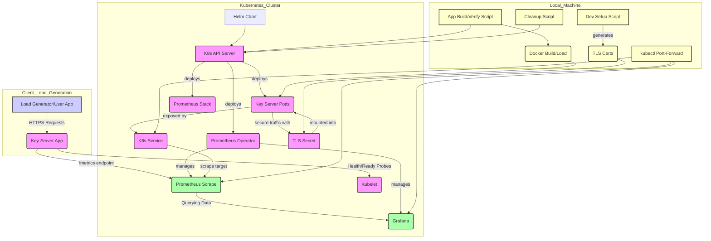

# Key Server Application: Comprehensive Design and Operational Review
----
### 1. Introduction & Problem Statement
---
The Key Server application provides a crucial security function in distributed systems: the on-demand generation of cryptographically secure random keys. These keys are fundamental for various purposes, including encryption, unique identifier creation, and secure session management. While programming languages offer built-in randomness, centralizing key generation into a dedicated service brings significant advantages:

  * **Centralized Control and Audit:** It establishes a single, consistent point for key generation, ensuring uniform algorithms, entropy sources, and simplified auditing of key creation events.
  * **Scalability:** Key generation can be scaled independently of the services that consume keys, allowing each component to grow based on its specific demand.
  * **Security Isolation:** Sensitive operations like gathering entropy and deriving keys are confined to a dedicated, potentially hardened, microservice, reducing the attack surface.
  * **Observability:** It enables specialized, focused monitoring of key generation rates, latency, and potential errors, which might otherwise be obscured within a larger application.
  * **Standardization:** This approach helps enforce consistent key characteristics (e.g., length, character sets) across an entire system.

This document details the current architecture, how its components interact, and strategic considerations for scaling, securing, and maintaining this vital service in a production environment.

---
### 2. Architecture Overview
---
The Key Server application is designed as a lean, observable microservice deployed within a Kubernetes environment. Our current local development and monitoring setup uses a robust collection of open-source tools:

**Core Components:**

1.  **Key Server Application (Go Lang):** The microservice itself, responsible for key generation and exposing metrics.
2.  **Kubernetes (Kind):** A containerized Kubernetes cluster for local development and testing. It orchestrates the deployment and lifecycle of the application and monitoring stack.
3.  **Prometheus:** A powerful open-source monitoring system that collects metrics from the Key Server.
4.  **Grafana:** An open-source platform for analytics and interactive visualization, used to build dashboards from Prometheus data.
5.  **Helm:** A package manager for Kubernetes, used to deploy complex applications (like the Prometheus stack) and the Key Server application itself.
6.  **Supporting Scripts:** Automation scripts (`dev-setup.sh`, `app_build_and_verification.sh`, `cleanup.sh`) that streamline the setup, deployment, and teardown processes.

---
### 3. Component Deep Dive
---
#### 3.1. Key Server Application

  * **Core Functionality:** 
    * Written in Go, the application exposes HTTP/HTTPS endpoints for `/health`, `/ready`, `/key/{length}`, and `/metrics`. 
    * It uses Go's `crypto/rand` package for cryptographically secure random number generation, which is essential for its purpose.
  * **HTTPS/TLS Details:** 
    * The application supports HTTPS, configured through `TLS_CERT_FILE` and `TLS_KEY_FILE` environment variables.
        * **Self-Signed Certificates (Local/Dev):** 
          * For local development, `dev-setup.sh` generates self-signed certificates. 
          * This simplifies local setup, but clients (like `curl` or Prometheus) must be configured to skip TLS verification.
        * **Production TLS:** 
          * In a production environment, certificates must be issued by a trusted Certificate Authority (CA). 
          * Within Kubernetes, `cert-manager` is the standard tool for automating certificate lifecycle management from CAs like Let's Encrypt or internal CAs.
  * **Metrics Instrumentation (`promhttp`):** 
    * The Go application exposes a `/metrics` endpoint using Prometheus client libraries. 
    * This endpoint provides standard Go runtime metrics along with custom application metrics:
        * **`http_requests_total`:** 
          * A counter that tracks the total number of HTTP requests, labeled by status code (`code`), endpoint (`endpoint`), and the Kubernetes job (`job`).
        * **`key_generations_total`:** A counter for the total number of keys generated, labeled by `length`.
        * **`key_generation_duration_seconds_bucket`:** 
          * A histogram that records the distribution of key generation latencies, labeled by `le` (less than or equal to) for buckets, and `code`/`length`. 
          * Histograms are vital for calculating percentiles (e.g., 99th percentile latency) using PromQL's `histogram_quantile` function.
  * **Health/Readiness Probes:** 
    * Kubernetes uses `/health` (liveness) and `/ready` (readiness) endpoints to manage pod lifecycle.
        * **Liveness Probe:** 
          * Checks if the container is still running. If `/health` fails, Kubernetes will restart the pod.
        * **Readiness Probe:** 
          * Determines if the container is ready to serve traffic. 
          * If `/ready` fails, Kubernetes temporarily stops sending traffic to the pod. 
          * For the Key Server, readiness might involve checking internal dependencies (e.g., if it relied on an external entropy source or database).

#### 3.2. Kubernetes (Kind)

  * **Kind for Local Development:** 
    * Kind (Kubernetes in Docker) provides a lightweight, ephemeral Kubernetes cluster. 
    * It's excellent for local testing and CI/CD pipelines because it removes external cloud dependencies.
  * **Core Kubernetes Constructs:**
      * **Pods:** The smallest deployable units in Kubernetes, containing one or more containers (e.g., the Key Server application container).
      * **Deployments:** Manages the desired state of pods, ensuring a specified number of replicas are running and enabling controlled rolling updates.
      * **Services:** 
        * An abstract way to expose an application running on a set of Pods as a network service. 
        * Services provide stable IP addresses and DNS names, balancing traffic to pods and serving as discovery points for Prometheus.
      * **Secrets:** 
        * Securely store sensitive information like TLS certificates (`key-server-key-server-app-tls-secret`). 
        * These are mounted as files into the application pods.
      * **ConfigMaps:** 
        * Store non-sensitive configuration data (e.g., Grafana dashboard JSONs, Prometheus data source settings).
      * **Ingress (Optional):** 
        * Manages external access to services within a cluster, typically for HTTP/HTTPS traffic. 
        * While not the primary method for internal metrics scraping, it's used for external API access in the `app_build_and_verification.sh` script. 
        * Local Ingress verification can sometimes be challenging on macOS.
  * **Helm for Deployment:** 
    * Used to package and deploy the Key Server application and the `kube-prometheus-stack`. 
    * Helm charts define Kubernetes resources (Deployments, Services, ServiceMonitors, etc.) using templates and configurable values, promoting reusability and version control.

#### 3.3. Prometheus

  * **Pull Model:** Prometheus operates on a pull-based model, regularly fetching metrics from configured targets like the Key Server's `/metrics` endpoint.
  * **`ServiceMonitor` (CRD):** 
    * A Kubernetes Custom Resource Definition (CRD) provided by the Prometheus Operator. 
    * Instead of manually configuring Prometheus targets, `ServiceMonitor`s declaratively define how Prometheus should find and scrape services in Kubernetes.
        * **Key Detail:** 
          * `ServiceMonitor`s are discovered by the Prometheus Operator based on specific labels (e.g., `release: prometheus-stack`). 
          * Correctly labeling the `ServiceMonitor` is vital for the automatic discovery process.
        * **Endpoint Configuration:** 
          * Explicitly defining the `port` (referencing the named port from the Kubernetes Service), `scheme` (`https`), `path` (`/metrics`), and `tlsConfig` (especially `insecureSkipVerify: true` for development environments) is crucial for successful metric collection.
  * **Data Model:** 
    * Prometheus stores metrics as time series data, each identified by a metric name and a set of key-value pairs called labels (e.g., `http_requests_total{code="200", endpoint="https", job="key-server-key-server-app"}`). 
    * Labels are powerful for filtering and aggregating data.
  * **PromQL:** 
    * Prometheus Query Language is used for querying and aggregating time series data.
        * **`rate()` Function:** 
          * Calculates the per-second average rate of increase of a counter over a specified time window (e.g., `[30s]`). 
          * **Important Consideration:** 
            * Using a fixed, slightly larger time window (e.g., `[30s]` or `[1m]`) instead of Grafana's dynamic `$__interval` variable is often necessary for reliable dashboard displays. 
            * This is because `$__interval` can sometimes be too small for `rate()` to find enough data points, especially with sparse metrics or small scrape intervals.
        * **`histogram_quantile()`:** 
          * Used with histogram metrics (which have a `_bucket` suffix) to calculate percentiles (e.g., 99th percentile latency), providing valuable insights into the distribution of response times.

#### 3.4. Grafana

  * **Dashboarding & Visualization:** Grafana excels at creating rich, interactive dashboards from various data sources, including Prometheus.
  * **Data Source Provisioning:** Grafana supports provisioning data sources via ConfigMaps (e.g., `grafana-prometheus-datasource`).
      * **UID (Unique Identifier):** Each data source has a UID. Dashboards often reference data sources by this UID. 
      * **Key Detail:** 
        * Explicitly setting `uid: prometheus` in the provisioned data source ensures that custom dashboards can reliably find and connect to Prometheus, preventing "Datasource not found" errors.
  * **Variables (`$__interval`):** 
    * Grafana provides built-in variables like `$__interval` for dynamic query ranges. 
    * While useful, as discussed, it can sometimes lead to issues with `rate()` and is best explicitly controlled for critical rate calculations.
  * **Dashboard JSON Structure:** 
    * Grafana dashboards are defined in JSON. 
    * Modifying these JSON files directly (e.g., `http-overview.json`, `key-generation.json`) allows for precise control over queries, panel types, and visualization options.
        * **Debugging Blank Panels:** 
          * This often involves using the "Query Inspector" in Grafana and running the exact PromQL query directly in the Prometheus UI to pinpoint where the data is being lost (e.g., Prometheus not collecting it, or the PromQL query itself returning no data).

#### 3.5. Supporting Scripts

  * **`dev-setup.sh`:** 
    * Handles initial setup tasks like generating self-signed TLS certificates. 
    * It ensures the local environment is prepared for development.
  * **`app_build_and_verification.sh`:** 
    * This script acts as the orchestrator. 
    * It automates building the Go application and Docker image, setting up Kind, deploying Prometheus/Grafana via Helm, deploying the Key Server via Helm, and performing end-to-end API tests. 
    * It centralizes the deployment logic and applies all necessary configurations (e.g., Prometheus data source UID, dashboard JSONs).
  * **`cleanup.sh`:** 
    * Provides a clean slate by destroying the Kind cluster, Docker images, and other related resources. 
    * This is essential for repeatable development and troubleshooting.

---
### 4. Scaling Considerations
---
Scaling a production system requires scaling all its layers: the application, the monitoring infrastructure, and the underlying Kubernetes cluster.

### 4.1. Key Server Application Scaling

  * **Horizontal Scaling (Pods):**
      * **Strategy:** Utilize Kubernetes Deployments to manage multiple replicas of the Key Server.
      * **Automation:** 
        * Implement **Horizontal Pod Autoscaler (HPA)** to automatically adjust the number of Key Server pods based on metrics like CPU utilization, memory usage, or custom metrics (e.g., `http_requests_total` rate per second). 
        * This ensures the application scales out during peak demand and scales in during low periods, optimizing resource usage.
      * **Considerations:**
          * **Statelessness:** 
            * The Key Server is inherently stateless (each key generation request is independent), making it an excellent candidate for horizontal scaling.
          * **Resource Requests/Limits:** 
            * Define accurate `resources.requests` and `resources.limits` in the Deployment. 
            * This helps the Kubernetes scheduler place pods efficiently and prevents resource exhaustion on nodes.
          * **Pod Disruption Budgets (PDBs):** 
            * For critical services, define PDBs to guarantee a minimum number of healthy pods remain running during voluntary disruptions (e.g., node maintenance or upgrades), maintaining service availability.
  * **Vertical Scaling (Pod Resources):**
      * **Strategy:** Adjust the `resources.requests` and `resources.limits` for CPU and memory of individual pods.
      * **Automation:** 
        * **Vertical Pod Autoscaler (VPA)** can automatically recommend or even apply optimal CPU and memory requests/limits based on historical usage patterns. 
        * This is useful for services where horizontal scaling alone might not be sufficient or efficient.
  * **Load Balancing:** 
    * Kubernetes Services inherently provide load balancing across pods. 
    * For external access, Ingress controllers (like NGINX Ingress or cloud-provider specific ones) handle load balancing from outside the cluster.

---
#### 4.2. Monitoring Infrastructure Scaling (Prometheus & Grafana)

Scaling monitoring is as important as scaling the application itself.

##### 4.2.1. Current Monitoring Setup (Local/Dev)

* Our current setup uses a `kube-prometheus-stack` deployed via Helm, providing:

  * **Prometheus:**
      * **Scrape Interval:** Default 15-second scrape interval for targets.
      * **ServiceMonitor:** 
        * Discovers the Key Server application based on labels (`app.kubernetes.io/name=key-server-app`, `app.kubernetes.io/instance=key-server`, `release=prometheus-stack`). 
        * It's configured to scrape the `https` port on `/metrics` with `insecureSkipVerify: true` for local self-signed certificates.
      * **Metrics Collected:**
          * **`http_requests_total`:** 
            * Tracks total HTTP requests, broken down by `code` (e.g., 200, 404), `handler` (e.g., `/key/32`, `/health`), `job`, `instance`, `pod`, etc.
          * **`key_generations_total`:** Counts total key generation operations, labeled by `length` of the key.
          * **`http_request_duration_seconds_bucket`:** 
            * A histogram for HTTP request durations, labeled by `le` (bucket boundary), `code`, `handler`, etc.
          * **`key_generation_duration_seconds_bucket`:** 
            * A histogram for key generation latencies, labeled by `le` (bucket boundary), `length`.
      * **PromQL Usage:** 
        * Dashboards use `rate()` for per-second rates (e.g., `rate(http_requests_total{...}[30s])`) and `histogram_quantile()` for latency percentiles (e.g., `histogram_quantile(0.99, sum by (le, code) (rate(key_generation_duration_seconds_bucket{...}[30s])))`). 
        * The `[30s]` fixed interval was a key fix to ensure reliable data display.
  * **Grafana:**
      * **Data Source:** Configured to connect to Prometheus via a provisioned ConfigMap with `uid: prometheus`.
      * **Dashboards:** 
        * "Key Server HTTP Overview" and "Key Server Key Generation" are provisioned via ConfigMaps, providing visualizations for request rates, durations, and key generation specific metrics.
      * **Visualization:** 
        * Uses time-series panels with fixed color schemes for stability.

##### 4.2.2.Future Monitoring for Production Scale

* For a production environment, the monitoring setup needs to be significantly more robust, scalable, and comprehensive.

  * **Scaling Prometheus:**

      * **Vertical Scaling Limits:** 
        * While increasing CPU, memory, and persistent volume (PV) size for a single Prometheus instance works for a start, it has inherent limits. 
        * A single Prometheus can typically handle hundreds of thousands of active time series before becoming a bottleneck.
      * **Thanos (Primary Recommendation):** 
        * Thanos is a set of open-source components that extend Prometheus for high availability, long-term storage, and global query capabilities.
            * **Thanos Sidecar:** 
              * Runs alongside each Prometheus instance, uploading blocks of time series data to cost-effective object storage (e.g., S3, GCS, Azure Blob Storage). 
              * It also acts as an API gateway for querying.
            * **Thanos Store Gateway:** Exposes historical data stored in object storage to the Thanos Querier.
            * **Thanos Compactor:** 
              * Downsamples older data (e.g., from 15s resolution to 5m resolution) and applies retention policies, optimizing storage and query performance for historical data.
            * **Thanos Querier:** 
              * Provides a unified PromQL API endpoint. 
              * It fans out queries to all connected Prometheus instances (via sidecars) and Store Gateways, giving a single, global view of all metrics across multiple clusters or regions.
            * **Thanos Ruler:** 
              * Can evaluate Prometheus recording rules and alerting rules against the global view, storing the results back into Prometheus/Thanos.
      * **Benefits of Thanos:** 
        * High availability for Prometheus, cost-effective long-term data retention, a single global query view, and efficient downsampling.
      * **Mimir/Cortex:** 
        * For extremely large-scale or multi-tenant environments, cloud-native solutions like Grafana Mimir or Cortex offer horizontally scalable, Prometheus-compatible monitoring systems. 
        * These are often used for managed services or very large enterprises.
      * **Recording Rules:** 
        * Implement Prometheus recording rules to pre-aggregate frequently queried or computationally expensive PromQL expressions. 
        * This significantly speeds up dashboard load times and alert evaluation.

  * **Scaling Grafana:**

      * **High Availability:** In production, Grafana should run as multiple instances behind a load balancer.
      * **External Database:** 
        * Crucially, its internal configuration (users, dashboards, data sources) must be stored in a highly available external database (e.g., PostgreSQL, MySQL) rather than the default SQLite. 
        * This makes Grafana instances stateless and resilient to individual instance failures.
      * **Resource Allocation:** 
        * Allocate sufficient CPU and memory resources to Grafana pods based on the number of concurrent users and the complexity of dashboards.
      * **Caching:** 
        * Utilize external caching layers (e.g., Redis) for frequently accessed dashboard queries to further reduce load on Prometheus and improve response times.

  * **Advanced Alerting:**

      * **Alertmanager:** 
        * Prometheus Alertmanager is a standalone component that handles alerts sent by Prometheus. 
        * It's responsible for deduplicating, grouping, and routing alerts to various receivers (e.g., PagerDuty, Slack, email, OpsGenie). 
        * It also supports inhibition and silencing rules.
      * **SLOs/SLIs:** 
        * Define clear Service Level Indicators (SLIs) and Service Level Objectives (SLOs) for the Key Server (e.g., "99.9% of key generation requests must complete within 100ms"). 
        * Alerts should be built around deviations from these SLOs to ensure proactive notification of potential service degradation.
      * **Alerting on Compounded Metrics:** 
        * Create alerts based on derived metrics like error rates (e.g., `sum(rate(http_requests_total{code!="200"}[5m])) / sum(rate(http_requests_total[5m]))`) or latency spikes.

  * **Beyond Metrics (Comprehensive Observability):**

      * **Centralized Logging:** 
        * Implement a robust centralized logging solution (e.g., Grafana Loki with Promtail, ELK stack - Elasticsearch, Logstash, Kibana; Splunk; commercial solutions like Datadog). 
        * This collects, aggregates, and provides a searchable interface for all application and infrastructure logs.
          * **Structured Logging:** 
            * Encourage the Key Server application to emit structured logs (e.g., JSON format). 
            * This makes logs much easier to parse, query, and analyze programmatically.
          * **Contextual Logging:** 
            * Ensure logs include correlation IDs (e.g., trace IDs) to link log entries across different services for a single request.
      * **Distributed Tracing:** 
        * Implement distributed tracing (e.g., OpenTelemetry, Jaeger, Zipkin) to gain deep visibility into the end-to-end flow of requests across multiple microservices. 
        * This is invaluable for diagnosing latency, errors, and performance bottlenecks in complex, distributed architectures.
      * **Dashboards as Code (GitOps for Observability):** 
        * Continue the practice of storing Grafana dashboard JSONs, Prometheus recording rules, and alerting rules in Git. 
        * Tools like ArgoCD or Flux can then automatically synchronize these configurations from Git to the Kubernetes cluster, ensuring that observability assets are version-controlled, auditable, and easily deployable across environments.

---
### 5. Advanced Considerations
---
Beyond basic deployment and scaling, a senior engineer focuses on the robustness, security, and maintainability of the entire system for long-term production viability.

#### 5.1. Security

  * **TLS/Certificates:**
      * **Production CAs:** Always use certificates issued by a trusted Certificate Authority (CA) in production.
      * **`cert-manager`:** 
        * Implement `cert-manager` in Kubernetes to automate the issuance, renewal, and management of TLS certificates from CAs like 
        * Let's Encrypt or your internal CA.
  * **Network Policies:** 
    * Implement Kubernetes Network Policies to strictly control and restrict traffic flow between namespaces and specific pods, adhering to the principle of least privilege. 
    * For instance, only Prometheus should be allowed to access the Key Server's `/metrics` endpoint.
  * **RBAC (Role-Based Access Control):**
      * **Kubernetes:** 
        * Define precise RBAC roles and role bindings for all Kubernetes components (Prometheus Operator, Prometheus, Grafana, Key Server) to ensure they only have the absolute minimum necessary permissions to perform their functions.
      * **Grafana:** 
        * Configure Grafana's authentication (e.g., OAuth with a corporate identity provider like Okta/Azure AD, LDAP, SAML) and authorization (roles, folder permissions) to control who can view and edit dashboards.
  * **Secret Management:**
      * **Beyond K8s Secrets:** 
        * While Kubernetes Secrets are base64 encoded, they are not encrypted at rest by default in all Kubernetes distributions. 
        * For highly sensitive data (e.g., API keys, database credentials), consider integrating with external secret management solutions like HashiCorp Vault, AWS Secrets Manager, Azure Key Vault, or GCP Secret Manager, often using the Kubernetes CSI Secret Store driver for dynamic secret injection.
  * **Container Image Security:**
      * **Image Scanning:** Integrate automated container image scanning (e.g., Trivy, Clair) into CI/CD pipelines to detect known vulnerabilities in dependencies.
      * **Minimal Base Images:** Use minimal base images (e.g., `scratch`, `distroless`) to significantly reduce the attack surface of your application containers.

#### 5.2. High Availability & Disaster Recovery

  * **Kubernetes Cluster HA:**
      * **Multi-Node Clusters:** 
        * For production, always deploy multi-node Kubernetes clusters with multiple master/control plane nodes to eliminate single points of failure.
      * **Anti-Affinity Rules:** 
        * Configure pod anti-affinity rules in Deployments to ensure that pods of the same application (or critical monitoring components) are not scheduled on the same physical node. 
        * This improves resilience to individual node failures.
      * **Pod Disruption Budgets (PDBs):** 
        * As mentioned, PDBs ensure a minimum number of application pods remain available during voluntary disruptions (e.g., node upgrades).
  * **Prometheus HA:** 
    * As discussed in Scaling, Thanos is the key to achieving high availability for Prometheus. 
    * Run at least two identical Prometheus instances (using Thanos sidecars) for redundancy.
  * **Grafana HA:** 
    * Ensure Grafana is configured with an external, highly available database and multiple Grafana instances deployed behind a load balancer.
  * **Backup and Restore:**
      * **Prometheus:** 
        * Implement robust backup strategies for Prometheus's persistent volumes (or rely on Thanos automatically uploading blocks to object storage).
      * **Grafana:** 
        * Regularly back up Grafana's external database. Dashboard definitions are already version-controlled as JSONs in Git, aligning with GitOps principles.
  * **Disaster Recovery (DR):**
      * **Multi-Region/Multi-Cloud:** 
        * For extreme resilience, consider deploying the application and monitoring stack across multiple geographical regions or even multiple cloud providers. 
        * Thanos or similar solutions facilitate cross-region querying and provide global visibility.

#### 5.3. Performance Tuning

  * **Go Application Optimization:**
      * **Profiling:** 
        * Use Go's built-in `pprof` for CPU, memory, goroutine, and blocking profiles to identify and eliminate application-level bottlenecks.
      * **Concurrency:** 
        * Ensure `crypto/rand` is used efficiently and that I/O operations (if any external ones were introduced) are non-blocking.
  * **Prometheus Tuning:**
      * **Scrape Intervals:** 
        * Carefully adjust scrape intervals. 
        * Shorter intervals provide higher resolution but increase resource consumption. 
        * Longer intervals save resources but reduce visibility. 
        * Balance these based on your alerting and analysis needs.
      * **Retention:** 
        * Configure Prometheus's data retention period. Longer retention requires more disk space. 
        * Thanos helps offload older data to cheaper object storage.
      * **Query Optimization:** 
        * Optimize PromQL queries in dashboards and alerting rules to be as efficient as possible. 
        * Avoid `sum by ()` on too many labels, which can lead to "cardinality explosion" and performance degradation.
  * **Grafana Query Optimization:** 
    * Ensure dashboard queries are optimized and the time range is appropriate for the data resolution.

#### 5.4. Operational Best Practices

  * **Infrastructure as Code (IaC):** 
    * All infrastructure (Kubernetes manifests, Helm charts, `ServiceMonitor`s, Grafana dashboards, Prometheus rules) should be defined as code and version-controlled in Git. 
    * This enhances repeatability, auditability, and collaboration.
  * **CI/CD Pipelines:** 
    * Implement robust CI/CD pipelines for the Key Server application and its Helm charts:
        * **Continuous Integration (CI):** Automated testing (unit, integration), linting, Docker image building, security scanning.
        * **Continuous Delivery (CD):** Automated deployment to staging and production environments, ideally following GitOps principles.
  * **GitOps:** 
    * Use Git as the single source of truth for declarative infrastructure and applications. 
    * Tools like ArgoCD or Flux continuously synchronize the cluster's actual state with the desired state defined in the Git repository.
  * **Runbooks:** 
    * Create detailed runbooks for common operational procedures (e.g., "how to scale up", "how to troubleshoot high latency", "how to restore Prometheus data").
    * These are invaluable for incident response and knowledge transfer.
  * **Cost Optimization:**
      * **Resource Requests/Limits:** 
        * Accurately setting `resources.requests` and `resources.limits` helps Kubernetes efficiently pack pods onto nodes, reducing wasted capacity.
      * **Node Sizing:** 
        * Choose appropriate Kubernetes node sizes in cloud environments. Avoid over-provisioning.
      * **Data Retention Policies:** 
        * For Prometheus/Thanos, define sensible data retention policies to control storage costs. 
        * Older, high-resolution data might be compacted or moved to cheaper storage tiers.

By adopting these principles and expanding upon the current foundation, the Key Server application and its monitoring stack can evolve into a highly resilient, scalable, and secure production-grade service.

---